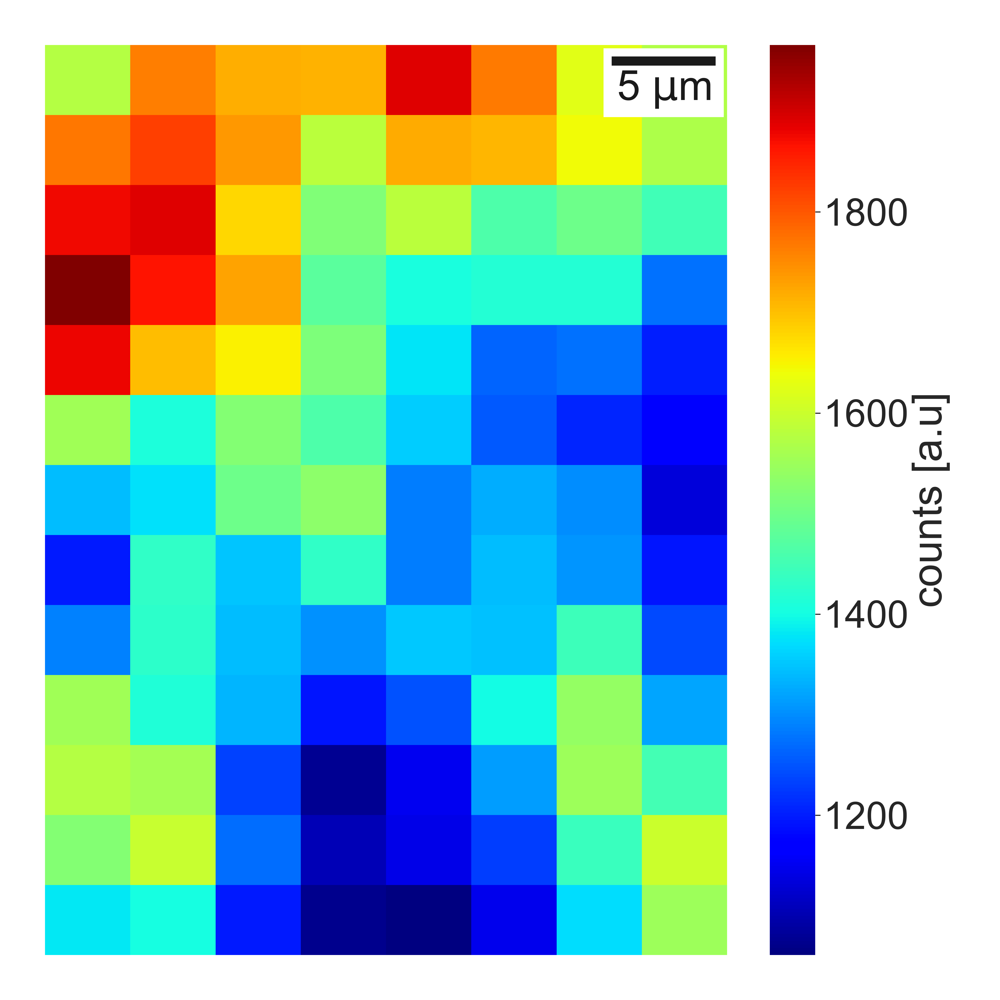

# Physical Spectroscopy Methods - Elemental Mapping

Physical Spectroscopy Methods like PIXE or SIMS might be great tools to probe thin tissue samples for elemental composition. Such a proccedure may lead to the discovery of new effects in our bodies or shine a new light on the underlying reasons 
of muscle diseases and cancers. The output data obtained using such methods consists of a matrix of ntensities of specific energies (coming from specific elements) on a mapped tissue sample. To visualize the elemental accumulation in a specific sample
area, there is a need of visualization of such probed surface. This scripts allows to map and visualize the obtained data, as in the form of the `exemple_file.csv`. Exemplary output result, in this case for the Na is shown on the image:

This project is a script in two versions: procedural programming `Elemental_map_comp.py` and object-oriented concepts `Elemental_map_comp_class.py` developed in Python. 
